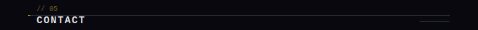

 

&nbsp;

&nbsp;

&nbsp;

&nbsp;

&nbsp;

<picture>
  <source media="(prefers-color-scheme: dark)" srcset="https://raw.githubusercontent.com/EnrikeRoe/EnrikeRoe/output/pacman-contribution-graph-dark.svg" />
  <source media="(prefers-color-scheme: light)" srcset="https://raw.githubusercontent.com/EnrikeRoe/EnrikeRoe/output/pacman-contribution-graph.svg" />
  
</picture>

&nbsp;

🔐 **Security**

 

💻 **Languages**

⚙️ **Backend & Infra**

🌐 **Frontend & Mobile**

🗄️ **Databases**

🤖 **AI & Automation**

🎮 **Game Dev**

&nbsp;

