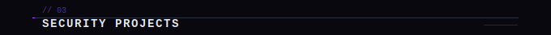

cat << 'EOF' > /home/claude/README.md

**`// Security`**

**`// Development`**

**`// Tools & Infra`**

| Project | Description | Stack | Status |
|---|---|---|---|
| [Vanta-G](https://github.com/EnrikeRoe/Vanta-G) | Vulnerability management platform with custom ASPS risk-scoring engine, Nmap/Nessus parsers, CISA KEV integration and 5 report formats including Ghost Mode | `Python` `Flask` `AES-256-GCM` `SQLite` | 🔒 Showcase |
| [Lethe-K](https://github.com/EnrikeRoe/Lethe-K) | Encrypted secrets manager for field use — per-field AES-256-GCM, PBKDF2 600k iterations, 4-level kill switch with duress password, 308 tests | `Python` `Flask` `SQLite` | ✅ Public |
| [Wraith Rotator](https://github.com/EnrikeRoe/Wraith-Rotator) | CLI tool for automated public IP rotation via ProtonVPN with iptables kill-switch, real-time TUI monitor and self-contained installer via `curl` | `Python` `Bash` `Linux` | ✅ Public |

| Project | Description | Stack | Status |
|---|---|---|---|
| [Echo-B](https://github.com/EnrikeRoe/Echo-B) | Multi-tenant SaaS chatbot platform with custom RAG pipeline — fully serverless Cloudflare stack, $0/month operating cost, role-based API, embeddable widget | `JavaScript` `Cloudflare Workers` `RAG` | 🔒 Showcase |
| [Omoide no Tabi](https://github.com/EnrikeRoe/Omoide-No-Tabi) | Gamified travel journal Android app built solo — date-driven progression, daily missions, collectibles, native audio recording, offline-first, no backend | `React Native` `Expo` `TypeScript` | 🔒 Showcase |
| [TrapCraft](https://github.com/EnrikeRoe/TrapCraft) | 2D platformer built solo — chunk-based level streaming, signal-driven trap systems, adaptive enemy AI with vision detection and wall climbing | `Godot 4` `GDScript` | 🔒 Showcase |
| [Pulse](https://github.com/EnrikeRoe/Pulse) | Family emergency alert app — single button triggers max-volume alarm bypassing silent mode via FCM, WiFi sockets and BLE | `React Native` `Firebase` | 🚧 WIP |

EOF
echo "OK"
Salida

OK
